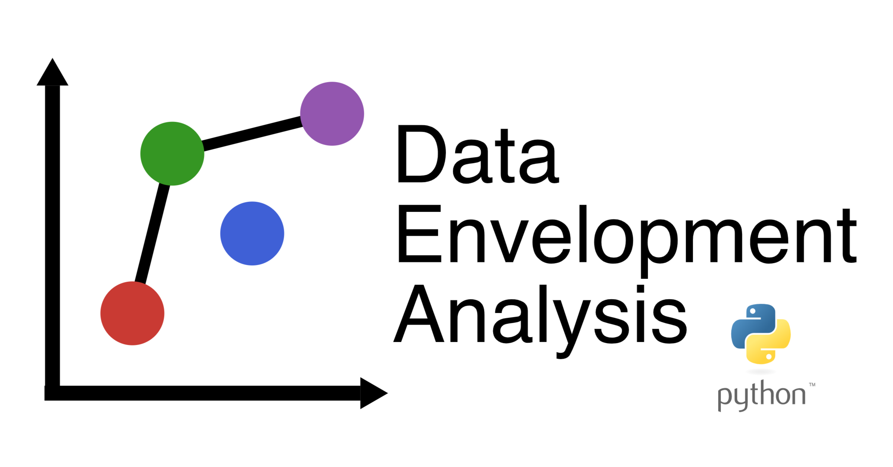

# DataEnvelopmentAnalysis.py



<!-- | Documentation | Build Status      | Coverage    | Zenodo      |
|:-------------:|:-----------------:|:-----------:|:-----------:|
| [![][docs-stable-img]][docs-stable-url] [![][docs-dev-img]][docs-dev-url] |  [![][githubci-img]][githubci-url] | [![][codecov-img]][codecov-url] | [![][zenodo-img]][zenodo-url] | -->

DataEnvelopmentAnalysis.py is a Python package that provides functions for efficiency and productivity measurement using Data Envelopment Analysis (DEA). Particularly, it implements a variety of technical efficiency models, economic efficiency models and productivity change models.

The package is being developed for Python `3.8.1` and above on Linux, macOS, and Windows.

The packes uses internally the [Pyomo](https://github.com/Pyomo/pyomo) modelling language for mathematicall optimization with solvers [GLPK](http://www.gnu.org/software/glpk/) and [Ipopt](https://coin-or.github.io/Ipopt/).

## Installation

The package can be installed with the Julia package manager:
```python
pip install dea-py
```

## Available models

**Technical efficiency DEA models**

* Radial input and output oriented model.
* Directional distance function model.
* Additive models: weighted additive model, measure of inefficiency proportions (MIP), normalized weighted additive model, range adjusted measure (RAM), bounded adjusted measure (BAM).
* Generalized distance function model.
* Russell graph and oriented model.
* Enhanced Russell Graph Slack Based Measure.
* Modified directional distance function.
* Hölder distance function.
* Reverse directional distance function.

**Economic efficiency DEA models**

* Cost model.
* Revenue model.
* Profit model.
* Profitability model.

**Productivity change models**

* Mamlmquist index.

## Authors

DataEnvelopmentAnalysis.py is being developed by [Firat Tamur](https://github.com/firattamur)
