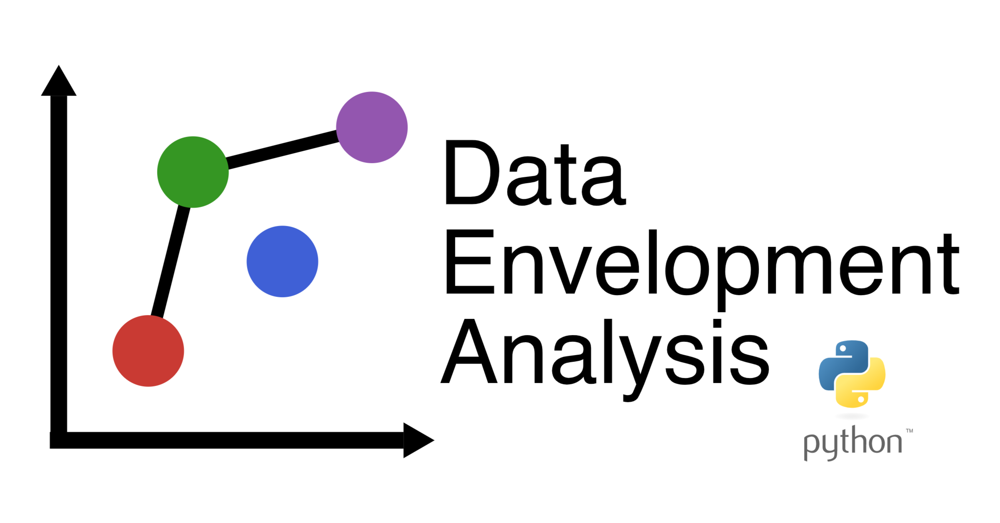

<h3 align="center">
	dea-py
</h3>

<!-- badges -->
<p align="center">

<!-- language -->


  
  
<!-- inprogress or completed -->
<!--  -->
	
<!-- inprogress or completed -->

	
<!-- licence -->

	
<!-- week of year -->
<!--  -->

</p>



<!-- | Documentation | Build Status      | Coverage    | Zenodo      |
|:-------------:|:-----------------:|:-----------:|:-----------:|
| [![][docs-stable-img]][docs-stable-url] [![][docs-dev-img]][docs-dev-url] |  [![][githubci-img]][githubci-url] | [![][codecov-img]][codecov-url] | [![][zenodo-img]][zenodo-url] | -->

<hr>

A Python wrapper for [DataEnvelopmentAnalysis.jl](https://github.com/javierbarbero/DataEnvelopmentAnalysis.jl) library.

* Python `3.8.1` and above on Linux, macOS, and Windows

* [Pyomo](https://github.com/Pyomo/pyomo) LP modeling library

* [GLPK](http://www.gnu.org/software/glpk/) and [IPOPT](https://coin-or.github.io/Ipopt/) LP solvers

<hr>

## Installation

The package can be installed with the Python Package Index (PyPI):
```python
pip install dea-py
```

<hr>

### Technical Efficiency DEA Models:

```python
radio_dea = RadialDEA()

X = np.array([[5, 13], [16, 12], [16, 26], [17, 15], [18, 14], [23, 6], [25, 10], [27, 22], [37, 14], [42, 25], [5, 17]])
Y = np.array([[12], [14], [25], [26], [8], [9], [27], [30], [31], [26], [12]])

radio_dea = RadialDEA(orient=Orient.Input, rts=RTS.CSR, disposX=Dispos.Strong, disposY=Dispos.Strong)
radio_dea.fit(X, Y)
radio_dea.dea()
radio_dea.pprint()

```

- [X] Additive Models: 

	```python
	X = np.array([[5, 13], [16, 12], [16, 26], [17, 15], [18, 14], [23, 6], [25, 10], [27, 22], [37, 14], [42, 25], [5, 17]])
	Y = np.array([[12], [14], [25], [26], [8], [9], [27], [30], [31], [26], [12]])
	```

	* Weighted Additive Model

	```python
	    additive_dea = AdditiveDEA()
	```

 	* Measure of Inefficiency Proportions Model(MIP)

	```python
	    additive_dea = AdditiveDEA(model=AdditiveModels.MIP)
	```

 	* Normalized Weighted Additive Model (NORM)

	```python
	    additive_dea = AdditiveDEA(model=AdditiveModels.NORM)
	```

 	* Range Adjusted Measure Model (RAM)

	```python
	    additive_dea = AdditiveDEA(model=AdditiveModels.RAM)
	```

 	* Bounded Adjusted Measure Model (BAM)

	```python
	    additive_dea = AdditiveDEA(model=AdditiveModels.BAM)
	```
	
	```python
	 additive_dea.fit(X, Y)
	 additive_dea.dea()
	 additive_dea.pprint()
	```

<hr>


## Authors

DataEnvelopmentAnalysis.py is being developed by [firattamur](https://github.com/firattamur)
